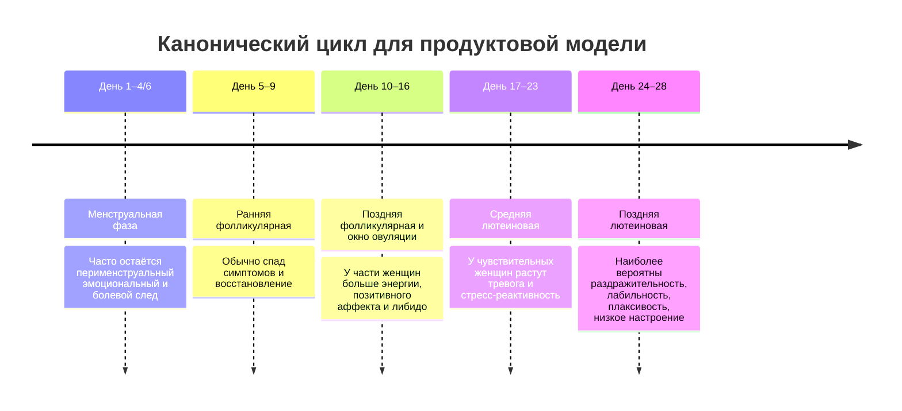
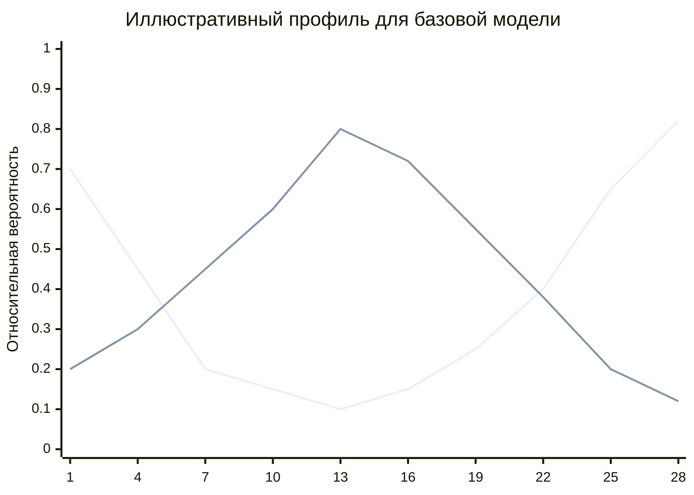

# Менструальный цикл и эмоциональное состояние женщины

## Executive summary

Для приложения, которое пытается предсказывать эмоциональные изменения только по дате начала менструации, главный вывод такой: **самое устойчивое окно риска для ухудшения настроения — поздняя лютеиновая и перименструальная область**, то есть последние дни перед менструацией и первые дни кровотечения. Именно этот паттерн подтверждается клиническими критериями ПМС/ПМДР, современными руководствами и проспективными исследованиями. При этом **универсального “обязательного ПМС у всех” не существует**: в популяции средние эффекты есть, но они обычно умеренные, а выраженная аффективная симптоматика концентрируется в подгруппах с ПМС, ПМДР, предменструальным обострением уже имеющихся психических или неврологических состояний, высоким стрессом и нарушением сна. citeturn39view2turn31search2turn20search7turn50search1

Для практической реализации это означает, что календарь должен быть **вероятностным, а не детерминистским**. Наиболее безопасная логика интерфейса: показывать не “сегодня она будет раздражительной”, а “в этот период у части женщин чаще усиливаются раздражительность/эмоциональная чувствительность; точность прогноза сейчас низкая/средняя/высокая”. Такой подход лучше соответствует доказательной базе и снижает риск стереотипизации. citeturn20search7turn39view2turn33view0

Есть и **позитивное окно**: поздняя фолликулярная фаза и период вокруг овуляции у части женщин ассоциированы с небольшим ростом положительного аффекта, энергичности, чувства привлекательности и сексуального желания. Но это тоже не универсальный закон и особенно ненадёжно предсказывается, если известна только дата последней менструации и нет истории предыдущих циклов. Важная практическая оговорка: представление об “овуляции строго на 14-й день” неверно; фолликулярная фаза заметно вариабельнее лютеиновой. citeturn42search0turn30search2turn11view3

Если ориентироваться на популяционные частоты, то: хотя бы один предменструальный симптом когда-либо отмечают до 90% женщин; симптомы, соответствующие критериям ПМС, встречаются примерно у 20–30%; подтверждённая по строгим критериям ПМДР в популяции встречается существенно реже — около 1.6% в community-выборках и порядка 3.2% в более широких подтверждённых выборках. В крупном международном опросе пользователей приложения настроение/тревога как предменструальные симптомы “каждый цикл” сообщались в 64.18% случаев, но это **ретроспективная** самооценка, а не проспективная ежедневная диагностика. citeturn33view0turn7search2turn7search0turn19search2

Для продукта из этого следуют четыре практических правила. Во-первых, минимальная модель должна рассчитывать **день цикла**, а не ставить “диагноз фазы по календарю”. Во-вторых, если нет истории хотя бы 3–6 циклов, все прогнозы по овуляции и поздней лютеиновой фазе должны маркироваться как **низкоуверенные**. В-третьих, приложение должно быстро переходить от популяционного шаблона к **персонализации по ежедневным симптомам**. В-четвёртых, приложение должно явно предупреждать, что выраженная депрессия, паника, ярость, суицидальные мысли или резкое падение функционирования — это уже не бытовой “характер в ПМС”, а повод для клинической оценки. citeturn11view3turn39view2turn33view0

## Что на самом деле говорит доказательная база

С научной точки зрения самые устойчивые результаты нельзя свести к фразе “цикл делает настроение плохим”. Качественный обзор проспективных исследований в неклинических выборках не нашёл ясного подтверждения существования специфического универсального “предменструального негативного настроения” у всех женщин; в одном из community-исследований ежедневное физическое самочувствие, воспринимаемый стресс и социальная поддержка объясняли ежедневное настроение сильнее, чем фаза цикла. citeturn20search7turn43view0

Одновременно крупные цифровые когорты показывают, что **внутрииндивидуальные циклические колебания по ряду эмоциональных измерений всё же существуют**. В анализе 241 млн наблюдений у 3.3 млн пользовательниц Clue менструальный цикл оказался крупнейшим из четырёх исследованных циклов для 7 из 9 измерений настроения; для пары “happy–sad” амплитуда менструального цикла составила 5.5%, что соответствовало примерно 22% относительному изменению вероятности логировать грусть относительно среднего уровня женщины. На графиках этого исследования максимум негативного сдвига приходился на дни перед началом менструации и первые дни кровотечения. citeturn11view2turn45view2turn40view1

То есть две вещи одновременно верны. Первая: **в среднем менструальный цикл действительно влияет на настроение**. Вторая: **этот эффект не настолько универсален и однотипен, чтобы безопасно навешивать на любую женщину одинаковый эмоциональный сценарий**. Это особенно важно для приложения “для мужчины”: если сделать слишком жёсткий прогноз, продукт начнёт воспроизводить мифологию, а не медицину. citeturn20search7turn11view2turn33view0

Клиническая картина наиболее ясна для предменструальных расстройств. И ACOG, и российские клинические рекомендации описывают ПМС как рекуррентное расстройство, развивающееся в лютеиновую фазу и ослабевающее после начала менструации; ПМДР выделяется как тяжёлая форма с доминированием аффективных симптомов и заметным нарушением функционирования. Для диагноза нужны **ежедневные проспективные записи симптомов как минимум в течение двух симптоматических циклов**. citeturn39view2turn39view0turn33view0

Из этого следует главный инженерный вывод: приложение может делать **календари вероятностей**, но не должно выдавать календарный прогноз за подтверждение ПМС/ПМДР. Для медицинически осмысленной верификации всегда нужны ежедневные симптомы, желательно по валидизированной шкале вроде DRSP или хотя бы простого календаря 1–5 баллов на день. citeturn39view3turn39view2turn33view0

## Фазы цикла и типичные эмоциональные паттерны

Ниже — практическая таблица для продуктовой логики. Она рассчитана на ситуацию, когда известна дата начала менструации, а овуляция при необходимости оценивается как **примерно за 12–14 дней до следующей менструации**, но с широкой неопределённостью, потому что фолликулярная фаза вариабельна сильнее лютеиновой. В большом исследовании средняя длина лютеиновой фазы была 12.4 ± 2.4 дня, а представление о фиксированной овуляции на 14-й день признано неверным. citeturn11view3

| Фаза | Практическая привязка по дням | Типичный гормональный контекст | Наиболее вероятный эмоциональный профиль | Уверенность для модели только по дате старта | Источники |
|---|---|---|---|---|---|
| Менструальная | День 1–4/6 от начала кровотечения | Падение эстрогена и прогестерона уже произошло; в первые дни ещё сохраняется перименструальный эффект | У части женщин остаются или достигают минимума позитивный аффект, энергия, терпимость к стрессу; возможны плаксивость, усталость, раздражительность, субъективное облегчение после начала кровотечения у тех, у кого симптомы были предменструально | Средняя, если известен конец кровотечения; ниже, если конец не введён | citeturn39view2turn31search2turn8search14turn52view1 |
| Ранняя фолликулярная | Примерно день 5–9 | Низкий прогестерон, постепенно растущий эстрадиол | Наиболее частое окно “восстановления”; для ПМДР/ПМС DSM- и ACOG-логика ожидает минимальные или отсутствующие симптомы в постменструальную неделю | Выше средней | citeturn39view2turn22search1turn33view0 |
| Поздняя фолликулярная | Примерно день 10–13 при 28-дневном цикле, но с большой вариабельностью | Высокий эстрадиол, низкий прогестерон | У части женщин повышаются бодрость, фокус, дружелюбие, чувство привлекательности; негативные эмоции могут снижаться | Низкая–средняя без истории циклов; средняя–высокая при регулярных циклах и истории стартов | citeturn42search0turn11view3 |
| Овуляторная | Окно вокруг оценённой овуляции ±1–2 дня | Пик эстрогена / LH-событие; прогестерон ещё не достиг лютеинового уровня | Наиболее вероятен небольшой пик положительного настроения и сексуального желания; у части женщин возможна овуляторная боль | Низкая без нескольких прошлых циклов | citeturn30search2turn30search1turn42search0turn11view3 |
| Средняя лютеиновая | Примерно +3 до +9 дней после овуляции или ~дни 17–23 при 28-дневном цикле | Высокий прогестерон и аллопрегнанолон | В общей психиатрической литературе тревога, стресс и binge eating чаще повышаются на протяжении лютеиновой фазы; у части женщин настроение ещё остаётся нейтральным | Средняя при регулярных циклах, низкая при нерегулярных | citeturn50search1turn39view2 |
| Поздняя лютеиновая | Последние 7 дней до менструации | Падение эстрогена и прогестерона; withdrawal-переход по ALLO/GABA | Самое типичное окно для раздражительности, эмоциональной лабильности, плаксивости, напряжения, чувства перегруженности, снижения интереса и иногда снижения либидо; именно здесь лежит клиническое ядро ПМС/ПМДР | Самая важная фаза для продукта, но всё ещё вероятностная | citeturn39view2turn22search1turn33view0turn31search2turn26search5 |

В продукте лучше считать, что **эмоциональный профиль — это не одно число, а вектор**: негативный аффект, раздражительность, эмоциональная лабильность, энергия, либидо и confidence. Тогда календарь можно строить честно: например, поздняя лютеиновая фаза = высокий риск раздражительности и лабильности при среднем или низком доверии прогноза; поздняя фолликулярная/овуляция = умеренный шанс на рост энергии/либидо при низком или среднем доверии. citeturn42search0turn30search2turn11view3

## Временные окна симптомов и вероятностные профили

Клинически наиболее важный паттерн задаётся не абстрактными “фазами”, а **окнами по дням относительно менструации**. DSM-5 требует, чтобы симптомы ПМДР появлялись в финальную неделю перед началом менструации, начинали снижаться в течение нескольких дней после её начала и становились минимальными в постменструальную неделю. ACOG повторяет ту же логику. Вторичный анализ данных, использованных при уточнении критериев ПМДР, показал, что в клинической выборке симптомы и функциональное нарушение были наиболее тяжёлыми в интервале **от 4 дней до менструации до 2-го дня менструации**, а в community-выборке — примерно **от 3 дней до менструации до 3-го дня цикла**. citeturn22search1turn39view2turn31search2



Эту временную структуру удобно переводить в **окна риска** для продукта:

| Окно | Дни | Наиболее вероятные изменения | Количественный якорь из литературы | Практический приоритет |
|---|---|---|---|---|
| Перименструальное ядро | −4…+2 относительно начала менструации | Пик раздражительности, лабильности, субъективной уязвимости; часто также боль, усталость и снижение ресурса | В клинической выборке ПМДР/PMS максимальная тяжесть и нарушение функционирования приходились именно на −4…+2; в community-выборке — на −3…+3 citeturn31search2 | Красная зона для напоминаний и мягкой коммуникации |
| Поздняя предменструальная неделя | −7…−1 | Тревога, напряжение, плаксивость, depressed mood, снижение интереса | DSM/ACOG: симптомы ПМДР должны быть в финальную неделю до менструации и быстро уменьшаться после её начала citeturn22search1turn39view2 | Главный предиктор тяжёлой эмоциональной симптоматики |
| Первые дни кровотечения | +1…+3 | У части женщин сохраняется отрицательный аффект; у части наступает облегчение относительно “предмесячных” дней | В когорте женщин с депрессией ежедневное настроение было минимальным от −3 до +2; у 54.3% среднее настроение в этом интервале было ниже, чем в остальном цикле citeturn8search14 | Важно не обрывать риск-окно ровно в день 1 |
| Постменструальная неделя | +4…+9 | Снижение аффективных симптомов, восстановление энергии и терпимости к нагрузке | В DSM/ACOG симптомы ПМДР должны стать минимальными или отсутствовать в постменструальную неделю citeturn22search1turn39view2 | Зелёная зона baseline |
| Поздняя фолликулярная и овуляция | Около дня овуляции, обычно ~следующая менструация −14 дней, но сильно зависит от длины цикла | Небольшой рост положительного настроения, фокуса, энергичности и сексуального желания | В проспективном исследовании у здоровых женщин в поздней фолликулярной фазе значимо росли friendly/cheerful/focused/active и снижались anxious/depressed/fatigued/hostile; в другом longitudinal-исследовании около овуляции росли general sexual desire и initiation of dyadic sexual behaviour citeturn42search0turn30search2 | Синяя или зелёно-бирюзовая зона “ресурса” |
| Вся лютеиновая фаза у уязвимых пользователей | От овуляции до начала менструации | Повышение тревоги, стресс-реактивности, binge eating; у части — постепенный спуск настроения | В comprehensive review тревога, стресс и binge eating чаще повышались на протяжении лютеиновой фазы, а проспективная EMA-когорта с депрессией показала постепенное ухудшение настроения, начинавшееся за 14 дней до менструации citeturn50search1turn8search14 | Нужен “жёлтый предриск”, а не только красный пик |

Важно различать **частоту симптомов** и **частоту расстройств**. Например, ретроспективно “mood swings or anxiety” как предменструальные симптомы “каждый цикл” отмечались у 64.18% участниц международного опроса Flo; но это не означает, что у 64% женщин есть клинический ПМС или что эти ощущения одинаково выражены. Клинически значимый ПМС по рекомендациям — гораздо уже, а подтверждённая ПМДР — ещё уже. citeturn19search2turn33view0turn7search2

Для приложения полезно показывать и **иллюстративный профиль вероятностей по дням**, но честно помечать его как *прикладной prior*, а не как “точные медицинские проценты”. Ниже — именно такая схема: форма кривой привязана к устойчивым окнам из руководств и проспективных работ, а конкретные числа должны калиброваться по пользовательским данным. citeturn39view2turn31search2turn42search0turn11view3



## Гормональные и нейроэндокринные механизмы

Современные руководства и обзоры сходятся в трёх базовых идеях. Первая: у женщин с ПМС/ПМДР проблема обычно не в том, что у них “слишком много” или “слишком мало” эстрогена/прогестерона в абсолютном смысле; важнее **повышенная чувствительность мозга к нормальным колебаниям половых гормонов** в цикле. И ACOG, и российские клинические рекомендации прямо указывают на чувствительность к нормальным флуктуациям эстрогена и прогестерона, а не на простую гормональную “поломку”. citeturn39view2turn33view0

Вторая идея связана с серотонином. Одна из ведущих моделей предполагает, что **падение эстрогена в поздней лютеиновой фазе** может запускать или усиливать дизрегуляцию серотонинергической системы, включая транспорт серотонина. Это косвенно поддерживается клинической эффективностью СИОЗС и тем, что депривация триптофана может ухудшать предменструальные симптомы. Для приложения это означает: поздняя лютеиновая фаза — не просто “хронологический” конец цикла, а окно потенциально сниженной устойчивости аффективной регуляции. citeturn39view2turn33view0turn28search3

Третья идея — **progesterone/allopregnanolone/GABA-A**. Аллопрегнанолон, метаболит прогестерона, является нейроактивным стероидом и мощным положительным модулятором GABA-A-рецептора; в норме это должно усиливать тормозное, успокаивающее влияние GABA. Но при ПМДР и части ПМС-подобных состояний проблема, по-видимому, в **аномальной чувствительности рецепторной системы к подъёму и последующему падению аллопрегнанолона**, особенно в лютеиновой фазе. Поэтому именно переходы уровня ALLO, а не только его абсолютное значение, связываются с тревогой, раздражительностью и депрессивным аффектом. citeturn39view2turn33view0turn12search4turn27search2turn29search20

Это помогает понять, почему у ПМДР могут помогать СИОЗС даже в **интермиттирующем режиме по симптомам или в лютеиновую фазу**: вероятно, часть их быстрого эффекта для предменструальных расстройств идёт не только через “классическую” антидепрессивную задержку, но и через влияние на нейростероидную регуляцию, включая аллопрегнанолон. И ACOG, и российские рекомендации отдельно отмечают эту гипотезу. citeturn39view2turn33view0

Дополнительный слой — **стрессовые системы и HPA-ось**. У женщин с ПМДР описаны изменения реакции на стресс, включая притуплённый кортизоловый ответ на острый психосоциальный стресс в поздней лютеиновой фазе, а обзор по ALLO/PMDD связывает уязвимость в этой фазе с недостаточным GABA-опосредованным контролем HPA-оси. На языке продукта это означает следующее: при высоком внешнем стрессе “нормально переносимая” фаза цикла может становиться субъективно гораздо тяжелее. citeturn29search18turn29search14turn29search6

Ещё один контур — **сон, циркадные ритмы и мелатонин**. Систематический обзор 2024 года показал, что для PMS/PMDD наиболее последовательно воспроизводятся более низкая секреция мелатонина, более высокая ночная температура тела и худшее субъективное качество сна. Это практическое основание собирать данные о сне и усиливать вес позднелютеиновых предикторов после коротких или фрагментированных ночей. citeturn38search0turn38search1turn38search6

Наконец, важно помнить, что нейробиология цикла влияет не только на “грусть/раздражительность”, но и на **энергию, мотивацию, социальную включённость и сексуальное желание**. В крупном цифровом анализе менструальный цикл был заметным источником вариации для happy–sad, happy–sensitive, energized–exhausted, motivated–unmotivated, focused–distracted и sociable–withdrawn, а в более узких проспективных работах поздняя фолликулярная фаза сопровождалась ростом позитивных состояний и сексуального влечения. citeturn45view2turn42search0turn30search2

## Межиндивидуальная вариабельность

Самая важная мысль для дизайна: **вариабельность между женщинами и между циклами у одной и той же женщины очень велика**, а значит приложение должно моделировать не “типичную женщину”, а “типичную неопределённость”. Это не косметическая деталь, а центральное требование к качеству продукта. citeturn20search7turn11view3

| Фактор | Что известно по данным | Как должен меняться алгоритм | Источники |
|---|---|---|---|
| Возраст | В данных >19 млн пользователей с возрастом циклы сначала становятся короче и чуть более вариабельными, а после 40–45 лет вариабельность резко растёт; у старших пользователей чаще логировались stress и insomnia, а mood swings были наиболее часты у самых молодых и самых старших | После 40 лет расширять окна неопределённости, понижать уверенность фазовых прогнозов, усиливать значение сна и стресса | citeturn46view0 |
| Регулярность цикла | Фолликулярная фаза намного вариабельнее лютеиновой; овуляция “на 14-й день” ненадёжна | Никогда не фиксировать овуляцию жёстко на день 14; использовать предыдущие старты менструаций и всегда показывать confidence | citeturn11view3 |
| Гормональная контрацепция | Систематический обзор и мета-анализ 2024 года: большинство исследований не находят значимого эффекта OC на психические симптомы, но часть работ указывает на риск; возможен больший риск депрессивных симптомов у подростков; в маленьком ежедневном исследовании пользователи OC показывали меньшую эмоциональную вариабельность, что интерпретировалось как возможное “emotional blunting” | Если пользовательница на гормональной контрацепции, не применять модель естественных фаз как есть; переключать на отдельный профиль “контрацептивный цикл/плоский ритм” | citeturn34view0turn32search4turn32search5 |
| ПМС / ПМДР / PME | ПМС и особенно ПМДР — это не “одна и та же вещь, только сильнее”; ПМДР — аффективно доминирующая, функционально тяжёлая; варианты включают предменструальное обострение уже существующего расстройства | Наличие диагноза должно резко повышать амплитуду симптомных окон; PME следует отделять от “чистого” ПМДР | citeturn33view0turn39view2 |
| Депрессия, биполярное расстройство и др. | Современный обзор показывает, что предменструальная и менструальная фазы чаще всего связаны с усилением психоза, мании, депрессии, суицидальности и алкоголизации; тревога и стресс могут быть повышены шире по лютеиновой фазе. Мета-анализ по коморбидности показал высокие показатели сопутствующих PMDD/PMS и mood disorders — около 42–49% | При психиатрическом анамнезе базовую модель следует делать более “чувствительной”, а предупреждения — более клинически осторожными | citeturn50search1turn48search5 |
| Стресс и травма | Мета-аналитически стресс коррелировал с тяжестью предменструальных симптомов (r=0.29); у лиц с core PMD стресс выше, особенно в лютеиновой фазе; история травмы более чем вдвое повышала вероятность PMS (OR 2.45) | Ежедневный стресс должен быть одним из сильнейших модификаторов амплитуды прогноза | citeturn37search3 |
| Сон | Нарушения сна и более низкий мелатонин последовательно связаны с PMS/PMDD; клинические и обзорные данные подкрепляют роль циркадной уязвимости | При плохом сне повышать прогноз риска по раздражительности, усталости и чувствительности к стрессу | citeturn38search0turn38search1turn38search11 |
| Курение, короткий сон, поздний отход ко сну, низкий BMI, нерегулярность цикла | Систематический обзор и мета-анализ по menstrual-related symptoms показал связи с менструальными симптомами и, для PMS, со smoking; для общей симптомной уязвимости значимы также stress, short sleep и irregular cycle | Эти факторы разумно использовать как modifiers, если пользовательница готова вводить их в профиль | citeturn36search2 |
| Хронические состояния | Российские рекомендации прямо выделяют предменструальное обострение депрессии, эпилепсии, мигрени и др.; обзор по психиатрии и BMJ Mental Health также подчёркивают трансдиагностическое перименструальное обострение | Нужен отдельный флаг “condition-sensitive cycle”, а не общий шаблон для всех | citeturn33view0turn50search14 |

С инженерной точки зрения полезно ввести отдельное понятие **confidence-of-phase**. Оно должно снижаться, если пользовательница старше 40 лет, если цикл нерегулярен, если нет истории как минимум трёх стартов, если используется гормональная контрацепция, если есть подозрение на ановуляторные циклы или если выраженные симптомы идут “весь месяц, но сильнее перед менструацией” — это уже больше похоже на PME, чем на чистую фазовую модель. citeturn46view0turn11view3turn33view0

## Модели для приложения

Ниже — четыре модели, расположенные по мере роста реалистичности. Все они предполагают, что обязательный ввод — **дата начала менструации**, а дата окончания — опциональна. Если окончания нет, продукт может использовать оценку длительности кровотечения. В реальных популяционных данных средняя длительность bleeding составила около 4.0 ± 1.5 дня; в одном крупном app-исследовании при отсутствии даты конца длительность автоматически задавалась как 5 дней. Для продукта допустимо использовать 5 дней как **UI-default**, но обязательно помечать это как оценку, а не факт. citeturn52view1turn52view3

### Таблица алгоритмов

| Модель | Обязательные входы | Опциональные входы | Выходы | Базовые параметры | Когда использовать | Главный риск |
|---|---|---|---|---|---|---|
| Наивная усреднённая | Последняя дата начала, текущая дата | Дата конца, несколько прошлых стартов | Один общий индекс “эмоциональной нагрузки” по дням цикла | default cycle_len=28; bleed_len=5; premenstrual_peak last 7 days | Очень ранний MVP | Слишком грубая и легко стереотипизирует |
| Фазо-ориентированная | Последняя дата начала | Конец, история стартов | Фаза, confidence, отдельные индексы: irritability, low mood, positive affect, libido | luteal_len default 12; ovulation ≈ next_start−12 | Базовый production-вариант без дневников | Ошибка овуляции при нерегулярных циклах |
| Вероятностная с вариабельностью | Последняя дата начала, история нескольких стартов | Конец, age, regularity | Распределения вероятностей симптомов по дням + confidence band | sigma фаз зависит от cycle_sd, age, irregularity | Нормальный production для календаря | Пользователь может воспринять вероятности как диагноз |
| Персонализируемая с калибровкой | Всё выше + ежедневные симптомы | Сон, стресс, контрацепция, лекарства, диагнозы | Индивидуальная кривая симптомов и адаптивные советы | EMA/Bayesian update per symptom | Лучший вариант после onboarding | Требует данных и аккуратной privacy-архитектуры |

### Наивная усреднённая модель

Это модель “минимально работоспособного календаря”. Она не пытается точно угадывать овуляцию, а всего лишь создаёт два основных бугра: **позднелютеиновый негативный** и **позднефолликулярный позитивный**. Такую модель стоит использовать только как стартовую и обязательно сопровождать низкой уверенностью. Её смысл хорошо согласуется с литературой: наиболее устойчивое окно ухудшения — последние 7 дней до менструации плюс первые дни кровотечения, а окно умеренного роста положительного аффекта/либидо — поздняя фолликулярная область. citeturn39view2turn31search2turn42search0turn30search2

```pseudo
function naiveModel(periodStarts, lastPeriodEndOptional, today):
    if count(periodStarts) >= 3:
        cycleLen = median(diff(last 6 periodStarts))
    else:
        cycleLen = 28

    bleedLen = daysBetween(lastStart, lastPeriodEndOptional) + 1 if lastPeriodEndOptional else 5

    day = daysBetween(lastStart, today) + 1
    day = clamp(day, 1, cycleLen)

    daysToNext = cycleLen - day + 1

    emotionalLoad = 0.0
    positiveLift = 0.0

    # менструальные дни
    if day <= bleedLen:
        emotionalLoad += 0.30

    # поздняя лютеиновая область
    if daysToNext <= 7:
        emotionalLoad += linearMap(daysToNext, from=7..1, to=0.10..0.45)

    # краткий остаточный перименструальный след
    if day <= 3:
        emotionalLoad += 0.10

    # грубое "середина цикла"
    if day >= 10 and day <= min(16, cycleLen - 11):
        positiveLift += 0.20

    score = positiveLift - emotionalLoad
    confidence = "low" if count(periodStarts) < 3 else "medium"

    return {
        phaseLabel: roughPhase(day, cycleLen, bleedLen),
        moodScore: score,                 # -1..+1
        irritabilityRisk: clamp(emotionalLoad, 0, 1),
        positiveAffectChance: clamp(positiveLift, 0, 1),
        confidence: confidence
    }
```

### Фазо-ориентированная модель

Это уже более правильная конструкция. Она опирается на историю стартов менструаций и использует то, что **лютеиновая фаза в среднем короче и стабильнее, чем фолликулярная**. Поэтому проще прогнозировать не “овуляцию на 14-й день”, а “следующую менструацию минус 12 дней” с допуском. Такая модель подходит для приложений, где нет ежедневного дневника симптомов, но пользователь регулярно отмечает старты менструаций. citeturn11view3

```pseudo
function phaseModel(periodStarts, lastPeriodEndOptional, today):
    cycleLen = median(diff(last 6 periodStarts)) if count(periodStarts) >= 3 else 28
    cycleSD  = std(diff(last 6 periodStarts)) if count(periodStarts) >= 4 else 4

    bleedLen = actualBleedLen(lastStart, lastPeriodEndOptional, default=5)
    lutealLen = 12            # инженерный prior
    predictedNextStart = addDays(lastStart, cycleLen)
    predictedOvulation = addDays(predictedNextStart, -lutealLen)

    day = daysBetween(lastStart, today) + 1
    daysToNext = daysBetween(today, predictedNextStart)

    if day <= bleedLen:
        phase = "menstrual"
    else if today < addDays(predictedOvulation, -2):
        phase = "follicular"
    else if today <= addDays(predictedOvulation, 2):
        phase = "ovulatory_window"
    else if daysToNext > 7:
        phase = "mid_luteal"
    else:
        phase = "late_luteal"

    symptomPriors = {
        menstrual:        {lowMood:0.45, irritability:0.35, lability:0.30, energyLow:0.55, libidoLow:0.35, positive:0.20},
        follicular:       {lowMood:0.15, irritability:0.12, lability:0.10, energyLow:0.20, libidoLow:0.15, positive:0.45},
        ovulatory_window: {lowMood:0.10, irritability:0.10, lability:0.10, energyLow:0.15, libidoLow:0.10, positive:0.70},
        mid_luteal:       {lowMood:0.22, irritability:0.25, lability:0.22, energyLow:0.28, libidoLow:0.20, positive:0.32},
        late_luteal:      {lowMood:0.55, irritability:0.65, lability:0.62, energyLow:0.45, libidoLow:0.40, positive:0.12}
    }

    confidence = phaseConfidence(cycleSD, count(periodStarts))

    return {phase, predictedOvulation, symptomPriors[phase], confidence}
```

### Вероятностная модель с вариабельностью

Это лучшая модель, если приложение хочет честно отражать неопределённость. Вместо “сегодня фаза X” она строит **непрерывные кривые вероятностей** по каждому симптому. Пик позднелютеинового риска моделируется как широкая гауссова или logistic-кривая около предсказанной следующей менструации, а позитивное окно — как более низкий пик около оценённой овуляции. Ширина кривых зависит от вариабельности цикла: чем цикл нерегулярнее, тем ниже пик и шире окно. Это лучше согласуется и с реальной биологией, и с UX. citeturn11view3turn39view2turn31search2

```pseudo
function probabilisticModel(periodStarts, lastPeriodEndOptional, today, ageOptional=None):
    cycleLen = robustCycleLength(periodStarts, default=28)
    cycleSD  = robustCycleSD(periodStarts, default=4)
    bleedLen = actualBleedLen(lastStart, lastPeriodEndOptional, default=5)

    predictedNextStart = addDays(lastStart, cycleLen)
    predictedOvulation = addDays(predictedNextStart, -12)

    d = dateToOrdinal(today)

    # ширина окон растет при нерегулярности и возрасте 40+
    sigmaLuteal = 2.0 + 0.4 * min(cycleSD, 8)
    sigmaOvul   = 1.5 + 0.5 * min(cycleSD, 8)
    if ageOptional != None and ageOptional >= 40:
        sigmaLuteal += 1.0
        sigmaOvul   += 1.0

    pLateLuteal = gaussian(d, center=ordinal(predictedNextStart) - 2, sigma=sigmaLuteal)
    pMenstrual  = gaussian(d, center=ordinal(lastStart) + 1, sigma=max(1.2, bleedLen/2))
    pOvulatory  = gaussian(d, center=ordinal(predictedOvulation), sigma=sigmaOvul)

    irritability = clamp(0.15 + 0.70 * pLateLuteal + 0.15 * pMenstrual, 0, 1)
    lowMood      = clamp(0.10 + 0.60 * pLateLuteal + 0.20 * pMenstrual, 0, 1)
    lability     = clamp(0.10 + 0.65 * pLateLuteal + 0.10 * pMenstrual, 0, 1)
    positive     = clamp(0.20 + 0.60 * pOvulatory - 0.25 * pLateLuteal, 0, 1)
    libido       = clamp(0.25 + 0.55 * pOvulatory - 0.20 * pMenstrual - 0.15 * pLateLuteal, 0, 1)

    confidence = confidenceScore(periodStarts, cycleSD, ageOptional)

    return {
        irritability, lowMood, lability, positive, libido,
        menstrualWindow: interval(lastStart, addDays(lastStart, bleedLen-1)),
        ovulationEstimate: predictedOvulation,
        confidence
    }
```

### Персонализируемая модель с калибровкой по симптомам

Это целевой вариант. Популяционные priors нужны только как старт. Далее приложение должно **переучиваться на конкретную пользовательницу**: когда у неё реально наступает пик раздражительности, есть ли вообще позитивное ovulatory-окно, сохраняются ли симптомы в первые дни менструации, насколько сильны они при плохом сне и как меняются на фоне контрацепции или СИОЗС. Именно здесь приложение становится по-настоящему полезным, а не просто красивым календарём. Не случайно и ACOG, и российские рекомендации настаивают на проспективном ежедневном дневнике симптомов как основе оценки. citeturn39view3turn33view0

```pseudo
function personalizedModel(userProfile, periodStarts, dailyLogs, today):
    base = probabilisticModel(periodStarts, userProfile.lastPeriodEnd, today, userProfile.age)

    for symptom in ["irritability", "lowMood", "lability", "positive", "libido"]:
        observedPattern = extractCycleAlignedSeries(dailyLogs, symptom)

        # обновляем амплитуду и день пика
        peakDay[symptom] = EMA(previous=peakDay[symptom], new=argmax(observedPattern), alpha=0.25)
        amp[symptom]     = EMA(previous=amp[symptom], new=max(observedPattern)-min(observedPattern), alpha=0.25)

        # обновляем sensitivity modifiers
        if recentPoorSleep(dailyLogs):
            modifier[symptom]["sleep"] = updateModifier(...)
        if recentHighStress(dailyLogs):
            modifier[symptom]["stress"] = updateModifier(...)

    # профилируем под контрацепцию / диагнозы
    if userProfile.hormonalContraception == True:
        flatten(base, factors=["ovulation", "lateLuteal"])
    if userProfile.PMDDdiagnosis == True:
        amplify(base, factors=["irritability", "lowMood", "lability"], gain=1.4)
    if userProfile.moodDisorder == True:
        widen(base, window="perimenstrual", extraSigma=1.0)

    personalized = applyLearnedPeaksAndAmplitudes(base, peakDay, amp, modifier)
    confidence = personalizeConfidence(dailyLogs, periodStarts, userProfile)

    return {personalized, confidence}
```

### Что собирать дополнительно и как это использовать

Чем больше приложение знает о **повторяемости собственных симптомов**, тем меньше ему приходится гадать по календарю. Наиболее полезные поля:

| Данные | Формат | Зачем нужны модели |
|---|---|---|
| Ежедневные оценки irritability, low mood, anxiety/tension, affective lability | 0–4 или 0–10 | Это клиническое ядро ПМДР и основа персонализации |
| Энергия, fatigue, motivation, focus | 0–4 / 0–10 | Позволяют отличить “низкий ресурс” от “отрицательного аффекта” |
| Либидо / sexual interest | 0–4 / 0–10 | Помогает поймать mid-cycle positive window, если он есть |
| Сон: часы, качество, пробуждения | авто + ручной ввод | Сильный модификатор позднелютеиновой уязвимости |
| Стресс / важные события | 0–10 + чекбокс major stressor | Повышает амплитуду прогноза в соответствующем окне |
| Боль, cramps, bloating, headache | 0–10 | Соматическая нагрузка часто усиливает эмоциональную реактивность |
| Контрацепция | тип, режим, дата начала | Меняет саму форму модели |
| Лекарства | СИОЗС, стимуляторы, анксиолитики, гормоны и пр. | Меняет амплитуду и тайминг симптомов |
| Диагнозы | ПМС/ПМДР, депрессия, тревожное расстройство, БАР, ADHD, мигрень, эпилепсия, эндометриоз, PCOS, болезни щитовидной железы | Позволяет различить “фазовую” и “коморбидную” логику |
| Возраст и признаки перименопаузы | возраст, нерегулярность, приливы и т.п. | Нужны для снижения уверенности и расширения окон |

Эти поля оправданы не “общими соображениями”, а тем, что диагностика ПМС/ПМДР требует именно ежедневных перспективных записей, а систематические обзоры связывают тяжесть симптомов с контекстом сна, стресса, травмы, возраста и коморбидности. citeturn39view3turn37search3turn38search1turn46view0turn48search5

## Визуализация, ограничения и риски

### Визуальные варианты календаря

Для такого продукта лучше работает не одна “магическая иконка”, а **двухслойное представление**: слой симптомного риска и слой уверенности прогноза.

| Элемент | Что показывает | Практический смысл |
|---|---|---|
| Фоновый градиент дня | Общий индекс эмоциональной нагрузки от низкого к высокому | Быстрое чтение календаря |
| Верхняя полоса-фаза | Менструация / восстановление / ovulatory-window / late-luteal-risk | Редуцирует когнитивную нагрузку |
| Иконки | Капля — bleeding, молния — раздражительность, облако — low mood, луна — sleep risk, искра — positive/energy window | Позволяет мультисигнальность без текста |
| Точечная линия неопределённости | Ширина ovulation-window и late-luteal-window | Помогает не воспринимать прогноз как точку |
| Всплывающая подсказка | Формулировка в терминах вероятности и уверенности | Снижает риск стигмы |

Рекомендуемая цветовая система должна быть **нейтральной и доступной**, а не “розовой шкалой эмоциональности”. Практичный пример:

| Уровень | Диапазон вероятности симптомной нагрузки | Цвет | Дополнительный маркер |
|---|---:|---|---|
| Низкий | 0.00–0.19 | Сине-зелёный | Без иконки |
| Умеренно низкий | 0.20–0.39 | Светлый бирюзово-серый | Тонкая точка |
| Средний | 0.40–0.59 | Янтарный | Небольшой значок волны |
| Высокий | 0.60–0.79 | Оранжевый | Значок “напряжение/молния” |
| Очень высокий | 0.80–1.00 | Красно-оранжевый | Значок + tooltip с предупреждением |

Поверх этого стоит добавить **слой confidence**: например, высокую уверенность показывать насыщенностью, а низкую — полупрозрачностью или штриховкой. Это особенно важно, потому что при отсутствии истории нескольких циклов оценка овуляции и позднелютеинового окна может быть весьма грубой. citeturn11view3turn46view0

Примеры формулировок для tooltips лучше делать такими:

- “Для части женщин в этот период чаще усиливаются раздражительность и эмоциональная чувствительность. Точность прогноза: средняя.”
- “Оценка основана только на датах начала менструаций; без симптомного дневника это ориентир, а не факт.”
- “Если появляются выраженная депрессия, паника, ярость, мысли о самоповреждении или резкое снижение работоспособности, это требует медицинской оценки.”

Такой язык соответствует тому, что предменструальные расстройства являются диагнозом исключения, требуют проспективных записей и при умеренно-тяжёлых симптомах должны сопровождаться оценкой суицидальности. citeturn39view2turn33view0

### Ограничения и предупреждения

Самое важное ограничение: **по одной дате начала менструации нельзя надёжно восстановить овуляцию, гормональный профиль или индивидуальную эмоциональную траекторию**. Даже если приложение знает несколько стартов, оно всё равно видит лишь bleeding-onset, а не факт овуляции и не психическое состояние. Поэтому любой “умный” календарь без симптомного дневника остаётся моделью приоритета, а не клиническим мониторингом. citeturn11view3turn39view2

Второе ограничение: большая часть day-by-day литературы по эмоциям неоднородна методологически. В неклинических выборках часть работ вообще не находит выраженной фазовой динамики, а там, где динамика есть, её сила варьирует в зависимости от дизайна, выбора фаз, критериев овуляции и наличия/отсутствия ПМС-чувствительных участниц. Поэтому не стоит делать “жёсткие” микропредсказания вроде “день 26 = высокий риск плаксивости 73%”. Для большинства симптомов точнее говорить о **вероятностных окнах**. citeturn20search7turn43view0

Третье ограничение касается особых состояний: гормональная контрацепция, перименопауза, ановуляторные циклы, postpartum-периоды, синдром поликистозных яичников, эндометриоз, заболевания щитовидной железы, депрессия, БАР, ADHD, мигрень, эпилепсия и другие состояния могут радикально менять картину. Российские рекомендации специально выделяют предменструальное обострение основного заболевания как отдельный вариант. citeturn33view0turn50search14

Четвёртое ограничение — этическое. Приложение, предназначенное “для мужчины”, легко может перейти грань между поддержкой и **контролем/ярлыками**. Поэтому продукт должен строиться на принципах согласия, прозрачности и конфиденциальности: пользовательница должна понимать, какие данные используются; прогноз не должен использоваться для оправдания давления, обесценивания чувств или репродуктивного контроля; формулировки должны быть осторожными и уважительными. Это уже не столько медицинский факт, сколько необходимое требование безопасного дизайна. citeturn39view2turn33view0

### Практический итог для реализации

Если делать короткую продуктовую спецификацию, она выглядела бы так:

1. **Обязательный ввод**: дата начала менструации.  
2. **Желательный ввод**: дата окончания, история стартов, возраст, контрацепция, ежедневные 4–6 эмоциональных симптомов, сон и стресс.  
3. **Базовый алгоритм**: late-luteal risk + menstrual carryover + ovulatory positive window.  
4. **Выходы**: не диагноз, а вероятности по отдельным доменам — раздражительность, низкое настроение, эмоциональная лабильность, энергия, либидо, confidence.  
5. **UI**: цветовой градиент + confidence-overlay + tooltips на языке вероятностей.  
6. **Красные флаги**: суицидальные мысли, выраженная депрессия, приступы паники, неконтролируемая ярость, резкое падение функционирования — отдельный экран с рекомендацией обратиться за медицинской помощью.  

Эта архитектура лучше всего соответствует современной доказательной базе: она учитывает устойчивое позднелютеиновое/перименструальное окно, признаёт существование умеренного mid-cycle positive window, но не делает из этого универсального и жёсткого закона для всех женщин. citeturn39view2turn31search2turn42search0turn11view3turn20search7